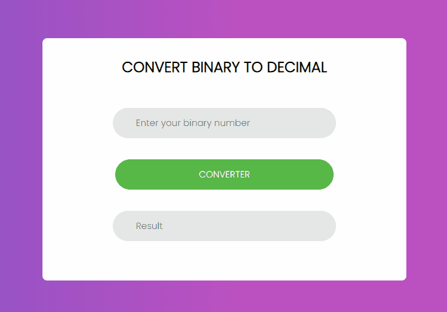

# Bin2Dec

Binary is the number system all digital computers are based on. Therefore it's important for developers to understand binary, or base 2, mathematics. The purpose of Bin2Dec is to provide practice and understanding of how binary calculations.

Bin2Dec allows the user to enter strings of up to 8 binary digits, 0's and 1's, in any sequence and then displays its decimal equivalent.

## 🚀 Starting

These instructions allowed you to get a copy of the project running on your local machine for development and testing purposes.

### 📋 Prerequisites

The following programs are required to use and modify the project.

- [Git](https://git-scm.com/)

- [NodeJs](https://nodejs.org/en/)

- [NPM](https://nodejs.org/en/)

### 🔧 Instalation

A series of step-by-step examples that tell you what you must do to get a development environment running.

```
# Clone this repository
$ git clone https://github.com/mateus2a/Bin2Dec.git bin2dec
  
# Access the project folder in the terminal/cmd
$ cd bin2dec

# Install dependencies
$ npm install

# Run the application
$ npm start
```
> ⚠️ The server will start at port:3000 - Access <http://localhost:3000>

## 🎥 Demonstration
 |
## 🛠️ Technologies used

The following tools were used in the construction of the project:

- [HTML5](https://developer.mozilla.org/pt-BR/docs/Web/HTML/HTML5)
- [CSS3](https://developer.mozilla.org/pt-BR/docs/Archive/CSS3)
- [React](https://pt-br.reactjs.org/docs/getting-started.html)

## ✒️ Authors

Here are all the contributors to the project.

* **Mateus Alencar** - *Initial Work, Documentation* - [mateus2a](https://github.com/mateus2a)

## 📄 License

This project is under the MIT license - see the [LICENSE.md](https://github.com/mateus2a/Bin2Dec/blob/master/LICENSE) file for details.

---
By [Mateus Alencar](https://github.com/mateus2a)
